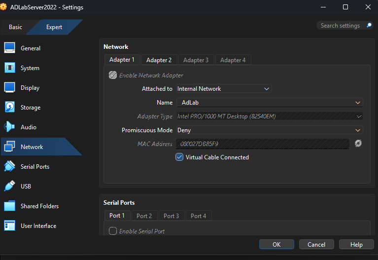
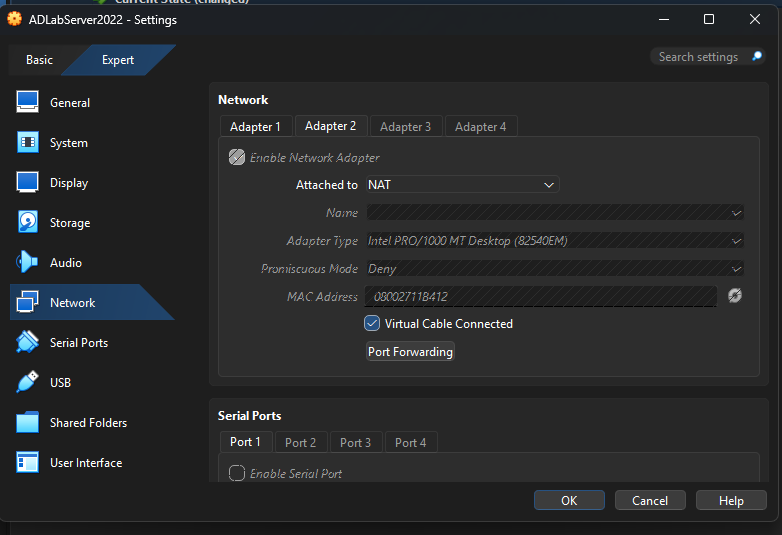

# Lab Architecture

This document consolidates the infrastructure-level decisions behind the lab: the virtualization platform, the two virtual machines, the network topology that connects them, and the snapshot discipline that made the build resilient to mistakes. The goal is to capture the *why* behind choices that the step-by-step build documents take as given.

---

## Host environment

The lab runs on a single physical host using **Oracle VirtualBox** (version 7.x, Expert Mode) as the hypervisor. VirtualBox was selected over alternatives (VMware Workstation, Hyper-V) for three reasons:

- **Cost.** Free for personal use, with no feature gating relevant to a small AD lab.
- **Cross-platform consistency.** The same VM configuration files work on Windows, macOS, and Linux hosts, which makes the lab portable if the host changes.
- **Internal Network support.** VirtualBox's *Internal Network* attachment type provides true isolation between named virtual networks, which is what the lab's `AdLab` segment needs (see network topology below).

VirtualBox **Expert Mode** is used for VM settings rather than the default Basic view. Expert Mode exposes all four network adapter slots simultaneously and surfaces the full set of attachment options on a single screen, which is necessary for the dual-NIC build documented below. The reorganization of VirtualBox's UI in recent releases is part of why the source course's network instructions no longer matched the current product — see [Issue 5 of the troubleshooting log](06-troubleshooting.md#issue-5--virtualbox-network-configuration-after-ui-redesign).

---

## VM inventory

Two virtual machines make up the lab:

| VM | Role | Operating System | Hostname |
|----|------|------------------|----------|
| **ADLabServer2022** | Domain controller, DNS server, certificate authority, file server | Windows Server 2022 Standard (Evaluation) | `DC01` |
| **ADLabClient** *(name in your VirtualBox library may differ)* | Domain-joined workstation | Windows 11 Pro | `WORKSTATION01` *(placeholder — update with your actual hostname)* |

### Resource allocations

| Resource | DC01 (Server) | Client (Win 11) |
|----------|---------------|-----------------|
| Memory | 8 GB RAM | 4 GB RAM (recommended minimum for Win 11) |
| CPU | 4 cores | 2 cores |
| Storage | 50 GB virtual disk | 64 GB virtual disk |
| Storage controller | IDE *(see below)* | Default (SATA was acceptable for client install) |

The DC uses an **IDE storage controller** rather than the VirtualBox default of SATA. This wasn't a design choice up front — it was the resolution to an installation issue where the Server 2022 installer threw inconsistent read errors when the ISO was attached via SATA. Switching to IDE eliminated the I/O failures and the installation completed cleanly. The full diagnosis is in [Issue 2 of the troubleshooting log](06-troubleshooting.md#issue-2--installer-failing-to-read-from-virtual-disk).

The 50 GB disk size for the DC was chosen to leave headroom for snapshot growth. VirtualBox snapshots store the *delta* from the snapshot point, so a server with active workloads will accumulate snapshot data over time; oversizing the base disk avoids running out of space mid-experiment.

---

## Network topology

The lab uses a **dual-NIC architecture**: an isolated internal network for all domain traffic, and a separate NAT adapter for internet egress. This mirrors a common enterprise pattern of segregating administrative traffic from general egress paths and keeps the domain functioning deterministically regardless of the host's network conditions.

```
┌──────────────────────────────────────────────────────────────┐
│  VirtualBox Host                                             │
│                                                              │
│  ┌────────────────────────────────────────────────────────┐  │
│  │  Internal Network: AdLab (192.168.1.0/24)              │  │
│  │                                                        │  │
│  │  ┌─────────────────┐         ┌─────────────────────┐   │  │
│  │  │  DC01           │         │  WORKSTATION01      │   │  │
│  │  │  Server 2022    │ ◄─────► │  Windows 11 Pro     │   │  │
│  │  │  192.168.1.10   │         │  192.168.1.20       │   │  │
│  │  │                 │  SMB    │                     │   │  │
│  │  │  AD DS · DNS    │  LDAP   │  Domain-joined      │   │  │
│  │  │  AD CS · Files  │  Kerb.  │  client             │   │  │
│  │  └────────┬────────┘         └──────────┬──────────┘   │  │
│  │           │ Adapter 1                   │ Adapter 1    │  │
│  └───────────┼─────────────────────────────┼──────────────┘  │
│              │                             │                 │
│              │ Adapter 2 (NAT)             │ Adapter 2 (NAT) │
│              ▼                             ▼                 │
│         ┌─────────────────────────────────────────┐          │
│         │             Host NAT layer              │          │
│         └────────────────────┬────────────────────┘          │
└──────────────────────────────┼───────────────────────────────┘
                               │
                               ▼
                          ╔═════════╗
                          ║Internet ║
                          ╚═════════╝
```

### Adapter 1 — Internal Network (`AdLab`)

This is the lab's domain segment. Both VMs have an Adapter 1 attached to a VirtualBox Internal Network named `AdLab`, which creates a private switch visible only to VMs on that named network. The host itself is **not** on this segment, and the segment has no path to the internet — both deliberate properties.



**Why Internal Network rather than Host-Only or Bridged:**

- **Bridged** would put the VMs on the host's physical LAN, which would expose lab traffic to other devices on the home network and risk DNS/DHCP collisions with the home router.
- **Host-Only** would let the host participate in the lab segment, which can be convenient but blurs the boundary between lab and host (host firewall, host name resolution, host security tools all start to matter).
- **Internal Network** isolates lab traffic to just the VMs on the named network. Nothing on the host LAN sees the lab, and the lab sees nothing of the host LAN. This is the cleanest separation for a domain experiment.

### Adapter 2 — NAT (internet egress)

Both VMs also have an Adapter 2 attached to **NAT**. This lets the guest reach the internet for OS updates, RSAT installation, and any other pulls — without putting the guest on the host's LAN segment.



VirtualBox's NAT mode gives each VM its own isolated NAT instance — the VMs can reach outbound, but they can't reach each other through this adapter (and they don't need to; that's what Adapter 1 is for).

**Why two NICs instead of one:**

A single bridged adapter would technically also provide both internet access and inter-VM communication. The dual-NIC approach is cleaner because:

- **Domain traffic stays on the isolated segment.** Authentication, replication, file share access, and Group Policy delivery all happen on Adapter 1 with no chance of leaking onto the host LAN.
- **Internet traffic has a separate, explicit path.** If something goes wrong with internet egress (host DNS issue, captive portal, ISP outage), the lab continues to function — domain traffic is unaffected.
- **The design mirrors enterprise practice.** Production servers commonly distinguish "management" and "service" traffic across separate NICs or VLANs. A junior admin who builds the habit on a lab understands the pattern when they see it in production.

---

## IP addressing plan

Static IPs are used inside the `AdLab` segment because the lab has no DHCP server, and because static addressing is the more deterministic choice for a domain controller anyway (DCs need stable addresses; clients reference them by IP for DNS).

| Host | IP address | Subnet mask | DNS server | Default gateway |
|------|-----------|-------------|------------|-----------------|
| `DC01` | `192.168.1.10` | `255.255.255.0` | `192.168.1.10` *(itself)* | *(none — isolated segment)* |
| `WORKSTATION01` | `192.168.1.20` | `255.255.255.0` | `192.168.1.10` *(the DC)* | *(none on Adapter 1)* |

### Why the DC's DNS points to itself

Active Directory depends on DNS for service location — clients find a domain controller by querying for `_ldap._tcp.LAB.local` SRV records, and those records live in the DNS zone the DC hosts. By pointing its own DNS configuration at itself, `DC01` can resolve domain queries during boot before any other DNS infrastructure is available. This is the standard small-environment configuration; in larger deployments with multiple DCs, each DC typically points its DNS to another DC first and itself second, but that's an optimization for environments the lab doesn't have.

### Why the client's DNS points to the DC, not to a public resolver

If the Windows 11 client used a public DNS resolver (8.8.8.8, 1.1.1.1) on its lab adapter, it would not be able to resolve `LAB.local` — those resolvers don't know anything about the lab's private domain. The client would also fail to find the domain controller during login, since locating a DC depends on resolving `_ldap._tcp.LAB.local`. Pointing the client's DNS at the DC is what makes domain join work.

The NAT adapter (Adapter 2) handles its own DNS resolution through VirtualBox's NAT layer, which forwards to whatever upstream resolver the host uses. Internet name resolution and lab name resolution are kept on separate paths.

---

## Snapshot strategy

Snapshots are VirtualBox's mechanism for capturing a VM's full state (disk + memory + configuration) at a point in time, with the ability to roll back. They are the closest thing a home lab has to the change-management discipline production environments enforce formally — and for a multi-step build like this one, they turn "I broke something" from a multi-hour rebuild into a few-minute restore.

### Snapshot points used in this lab

Snapshots were taken at three specific milestones, each chosen to be a known-good state to fall back to:

| Snapshot | Captured state | Why this point |
|----------|----------------|----------------|
| **Post-OS install** | Windows Server 2022 freshly installed; randomly-named host; no roles | Returns to a clean OS without re-running the installer |
| **Post-static IP configuration** | Networking confirmed working; host renamed to `DC01` | Returns to a configured-but-not-promoted server, before any AD complexity |
| **Pre-AD DS promotion** | Roles installed but server is still a member, not a controller | Last point at which the directory does not yet exist |

The third snapshot was directly responsible for the smooth resolution of [Issue 4 of the troubleshooting log](06-troubleshooting.md#issue-4--ad-ds-promotion-blocked-by-premature-ad-cs-install) — the AD CS / AD DS prerequisite collision. Rolling back to "pre-promotion" cleared the conflicting role state in seconds rather than requiring a re-install.

### Snapshot discipline as transferable practice

The snapshot pattern — *checkpoint before risky change, document the change, verify outcome, snapshot again on success* — is the same workflow that production change management codifies through change tickets, deployment freezes, and rollback plans. Building the habit at lab scale is one of the more useful infrastructure-engineering reflexes a home lab can cultivate.

---

## What this section demonstrates

- **Infrastructure decisions cascade.** The choice of Internal Network for Adapter 1 forces static addressing, which forces the DC-as-DNS-resolver pattern, which makes domain join work. Each decision is small in isolation; together they produce a deterministic lab environment.
- **Defaults are not always correct.** The IDE storage controller, the Expert Mode UI, and the dual-NIC design were all departures from VirtualBox's out-of-the-box defaults. Each was chosen because it solved a specific problem the default introduced.
- **Isolation is a feature.** Keeping the lab off the host LAN protects the lab from collisions with the home network and protects the home network from anything the lab does. For a domain experiment, isolation is part of what makes the lab a *lab*.
- **Snapshots are infrastructure too.** Treating snapshots as a planned part of the build — rather than something to remember when things go wrong — is the same shift in mindset that distinguishes production change management from reactive troubleshooting.

---

## Reference for the other documents

The build steps that follow are scaffolded on the architecture decisions captured here:

- [02 — Domain Controller Setup](02-domain-controller.md) installs Server 2022 onto the VM specified above and promotes it using the IP plan from this section.
- [03 — Identity Structure](03-identity-structure.md) populates the directory with users, groups, and a file share that depends on the Adapter-1 segment for SMB access.
- [04 — Group Policy](04-group-policy.md) deploys policies that assume the network and domain configuration documented here.
- [05 — PowerShell Automation](05-powershell-automation.md) runs cmdlets against the directory using the credentials and connectivity established by this architecture.
- [06 — Troubleshooting Log](06-troubleshooting.md) documents the diagnostic work that produced several of the architectural decisions above (storage controller, Expert Mode, dual-NIC).
