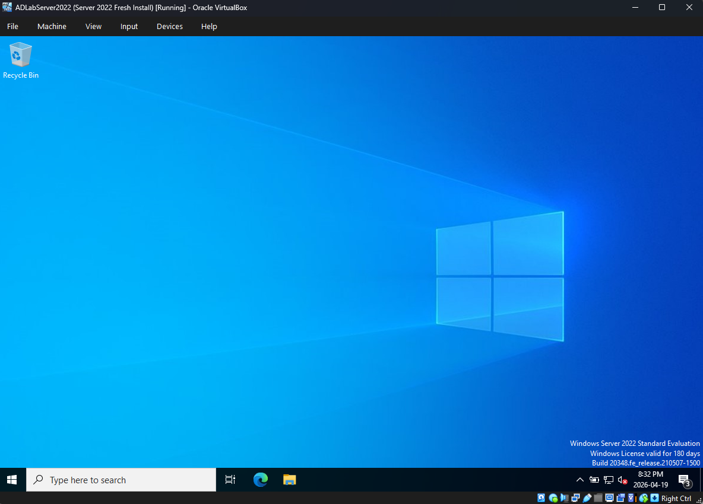
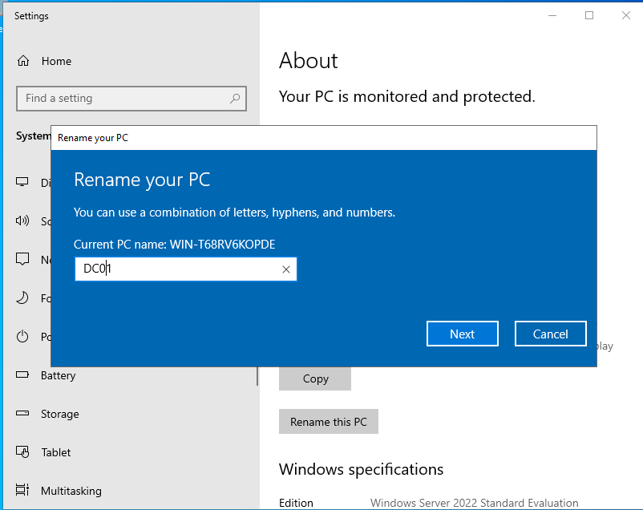
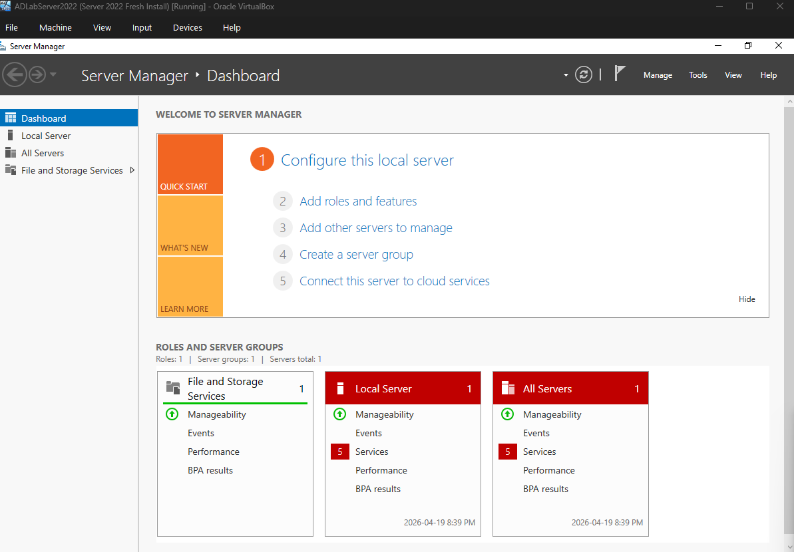
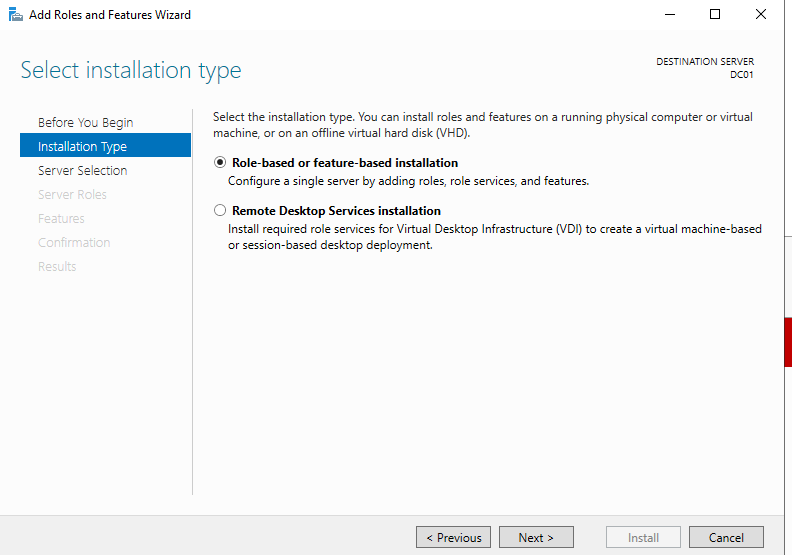
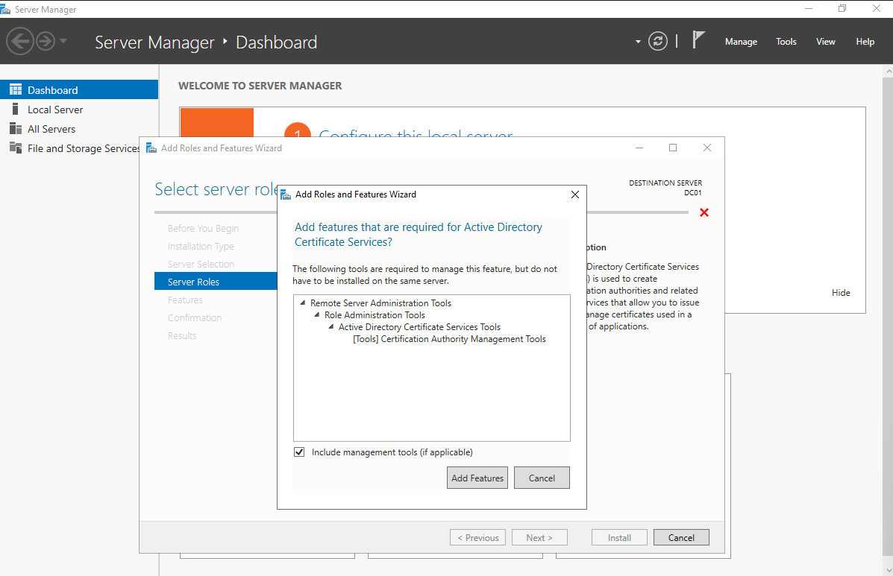
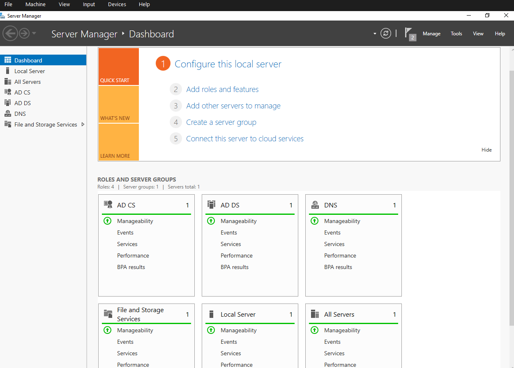

# Domain Controller Setup

This document walks through the build of `DC01`, the Windows Server 2022 host that serves as the lab's domain controller. The work covers the VM provisioning, fresh OS install, host renaming, Active Directory Domain Services (AD DS) installation, domain controller promotion (forest creation), and Active Directory Certificate Services (AD CS) configuration.

A couple of these steps are sequenced deliberately to avoid the role-dependency conflict described in [Issue 4 of the troubleshooting log](06-troubleshooting.md#issue-4--ad-ds-promotion-blocked-by-premature-ad-cs-install). The order presented here is the one that completes cleanly.

---

## VM specifications

The domain controller VM was provisioned in Oracle VirtualBox with the following resources:

| Resource | Allocation |
|----------|------------|
| Memory | 8 GB RAM |
| CPU | 4 cores |
| Storage | 50 GB virtual disk (IDE controller — see Issue 2) |
| Network — Adapter 1 | Internal Network (`AdLab`) — `192.168.1.10` |
| Network — Adapter 2 | NAT (internet egress) |
| OS | Windows Server 2022 Standard (Evaluation) |

Detailed network rationale and topology are covered in [01 — Lab Architecture](01-lab-architecture.md).

---

## Step 1 — Fresh Server 2022 installation

After resolving the installation issues documented in the troubleshooting log (corrupted ISO, storage controller selection, GPT partitioning), Windows Server 2022 installed cleanly. The first boot lands at a stock desktop with the *Server 2022 Standard Evaluation* watermark in the bottom-right.

At this point the server has no roles, no domain membership, and a randomly-generated computer name (here, `WIN-T68RV6KOPDE`).

---

## Step 2 — Rename the host to `DC01`

A randomly-named host is fine for a workgroup workstation but inappropriate for a domain controller, which other systems will reference by name. Renaming before promotion avoids a second reboot later in the process.

**Path:** Settings → System → About → Rename this PC → enter `DC01` → reboot.

After the reboot, the system identifies as `DC01` in Server Manager, in network discovery, and in the eventual domain promotion dialogs.

---

## Step 3 — Open Server Manager (baseline state)

Server Manager is the central administrative console for adding roles, configuring features, and monitoring the server. Before any AD work, the dashboard reflects only the default *File and Storage Services* role.

The dashboard's *Quick Start* checklist on the right (`Configure this local server`, `Add roles and features`) drives most of the configuration that follows.

---

## Step 4 — Install Active Directory Domain Services

From Server Manager: **Manage → Add Roles and Features**.

The wizard walks through installation type, server selection, role selection, and confirmation. The two consequential choices:

- **Installation Type:** *Role-based or feature-based installation* (the alternative, *Remote Desktop Services installation*, is unrelated to AD).
- **Server Roles:** *Active Directory Domain Services*. Selecting this also prompts the wizard to add the supporting management tools (Group Policy Management Console, Active Directory administrative snap-ins) — accept the defaults.

The role install itself is non-disruptive — the server stays available throughout. What it does *not* do is configure the server as a domain controller. That's a separate, deliberate step in the next section.

---

## Step 5 — Promote the server to a domain controller

After the AD DS role finishes installing, Server Manager surfaces a yellow notification flag at the top: **Promote this server to a domain controller**. This is the step that actually creates the directory.

The promotion wizard's key choices:

| Page | Selection | Reasoning |
|------|-----------|-----------|
| Deployment Configuration | **Add a new forest** | This is a greenfield environment; no existing forest exists to extend |
| Root domain name | **`LAB.local`** | `.local` keeps the namespace clearly internal and avoids collision with public DNS |
| Domain Controller Options | Defaults (DNS Server, Global Catalog, install at functional level Server 2016+) | Standard for a single-DC lab |
| DSRM Password | *(set and recorded)* | Directory Services Restore Mode password — separate from domain admin, used for offline directory recovery |
| DNS Options | Skip delegation warning | Expected for an isolated lab; no parent zone exists to delegate from |

The wizard runs a prerequisite check, completes the promotion, and the server reboots. On the next login, the credential prompt has changed: it now expects `LAB\Administrator` rather than the local `Administrator` account. The directory exists.

---

## Step 6 — Install Active Directory Certificate Services

With the server now a domain controller, Active Directory Certificate Services can be added without conflict. AD CS provides the public key infrastructure (PKI) that secures protocol traffic — LDAPS, smart card authentication, encrypted file system, and others rely on certificates issued by the domain CA.

When AD CS is selected, the wizard prompts to also add the *Certification Authority Management Tools*. Accepting these is required to administer the CA after install.

After installation completes, the post-install configuration step — accessible from the same Server Manager notification flag — runs through:

- **Setup Type:** Enterprise CA (integrates with AD; standalone is for non-domain environments)
- **CA Type:** Root CA (this is the first and only CA in the lab)
- **Private Key:** Create a new private key
- **Cryptography:** Default provider, **SHA-256** hash algorithm, 2048-bit key length
- **CA Name:** Default (derived from the domain name)

SHA-256 was selected explicitly. The default hash on older Windows Server builds was SHA-1, which is no longer acceptable for any production-realistic configuration; modern browsers and clients reject SHA-1 certificates outright.

---

## Step 7 — Verify the configured domain controller

After both roles install and configure, the Server Manager Dashboard reflects the completed state: four roles in the Roles and Server Groups section.

| Role | Source | Purpose |
|------|--------|---------|
| AD CS | Step 6 | Issues and manages certificates for the domain |
| AD DS | Step 4–5 | Hosts the directory; authenticates principals |
| DNS | Auto-installed during Step 5 | Resolves `LAB.local` and supports DC service location records |
| File and Storage Services | Default | Disk, volume, and share management |

The DNS role installs automatically as part of domain controller promotion because AD relies on DNS for service location (the `_ldap._tcp.LAB.local` SRV records that clients use to find a DC). Hosting DNS on the DC itself is the standard small-environment configuration.

---

## What this section demonstrates

- **Sequencing matters.** AD DS was promoted *before* AD CS was added. Reversing this triggers the prerequisite conflict in Issue 4.
- **DNS is part of AD, not a separate concern.** Promoting the DC also stood up DNS for the domain. Joining the Win 11 client later depends on the client pointing at this DC's IP for name resolution.
- **Cryptographic defaults are worth checking.** The SHA-256 selection during AD CS configuration was deliberate, not automatic. Older guides (and older Server builds) defaulted to weaker hashes.
- **Role installation and role configuration are separate phases.** Installing AD DS adds binaries and tools; promoting the server is what actually creates the directory. Conflating these is a common source of confusion in tutorial follow-along.

---

## Next steps

With the directory live, the next phase is populating it: organizational units, user accounts, groups, and file shares. That work is documented in [03 — Identity Structure](03-identity-structure.md).
