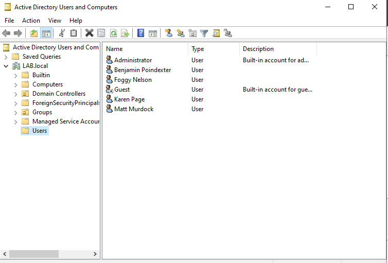
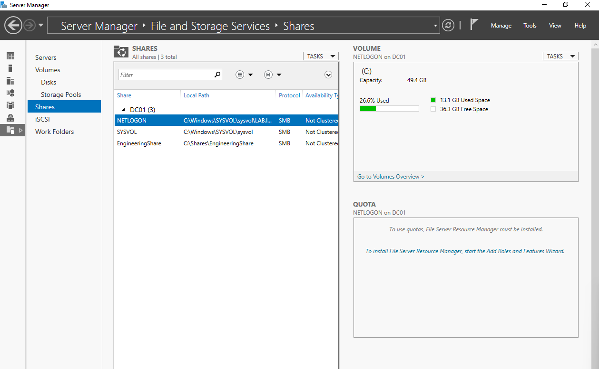

# Identity Structure

With `DC01` promoted and the `LAB.local` directory live, this section covers populating it: organizational unit (OU) design, user account creation, group structure, and a file share with scoped access permissions. Together these form the lab's identity and access foundation — the objects that Group Policy will later target ([04 — Group Policy](04-group-policy.md)) and that PowerShell will later automate ([05 — PowerShell Automation](05-powershell-automation.md)).

---

## Design rationale: why mirror business departments?

Active Directory provides two structural mechanisms that are easy to confuse: **organizational units** and **security groups**. Both contain users, but they exist for different purposes.

| | Organizational Unit (OU) | Security Group |
|---|---|---|
| **Primary purpose** | Apply Group Policy; delegate administration | Grant access to resources |
| **Membership rule** | A user belongs to **one** OU | A user belongs to **many** groups |
| **Targeting** | Hierarchy-based (location in the tree) | Membership-based (who is listed) |

The lab's OU structure mirrors departmental organization (Engineering, IT, Management) because that's the boundary at which policies tend to vary: an Engineering team might need access to development tooling and shared storage, IT needs administrative scope, Management has different desktop restrictions than individual contributors. Putting users in department-aligned OUs makes those distinctions easy to enforce later via GPO linkage.

Security groups, by contrast, exist at right-angles to OUs — they cut across departmental lines based on what someone needs to *do*, not where they sit organizationally. A user in the Management OU can still be a member of an "Engineering Administrators" security group if that's their function.

---

## Step 1 — Default state

After the domain controller promotion, **Active Directory Users and Computers** (Server Manager → Tools → Active Directory Users and Computers) shows the default container layout under `LAB.local`:



Visible in this baseline view:

- **Built-in containers:** `Builtin`, `Computers`, `Domain Controllers`, `ForeignSecurityPrincipals`, `Managed Service Accounts`, `Users` — these are auto-created during DC promotion and are not OUs in the strict sense (you'll notice they don't have the OU folder icon)
- **`Users` container:** holds all newly-created accounts by default until they're moved
- **Custom `Groups` OU:** added during this phase (visible at the bottom of the tree); existing security groups were dragged into it from `Users` to declutter the default container

The four new test users — Matt Murdock, Karen Page, Foggy Nelson, Benjamin Poindexter — are visible in the right pane alongside the built-in `Administrator` and `Guest` accounts.

> **Why characters from a TV show?** Realistic but obviously-fictional names make it immediately clear in screenshots and documentation that no real person's identity is being demonstrated. The Marvel Daredevil characters (Matt Murdock, Karen Page, Foggy Nelson, Benjamin "Bullseye" Poindexter) come from a recognizable cast that's easy to remember during multi-step exercises.

---

## Step 2 — Create the departmental OU hierarchy

Three custom OUs were created at the root of `LAB.local` to represent the lab's departmental structure:

```
LAB.local/
├── Engineering          ← custom OU
├── IT                   ← custom OU
├── Management           ← custom OU
├── Groups               ← custom OU (security groups consolidated here)
├── Builtin              (default)
├── Computers            (default)
├── Domain Controllers   (default)
├── ForeignSecurityPrincipals  (default)
├── Managed Service Accounts   (default)
└── Users                (default)
```

**Path:** Right-click `LAB.local` → New → Organizational Unit → enter name → OK.

By default, **Protect container from accidental deletion** is checked when an OU is created. This setting is left enabled for production-realistic OUs; it's a safeguard against the surprisingly common scenario of an admin right-clicking the wrong tree node and confirming a delete prompt without reading it.


---

## Step 3 — Populate OUs with user accounts

Users were created in their respective department OUs (or moved from the default `Users` container after creation). Final assignment:

| User | OU | Role |
|------|-----|------|
| Matt Murdock | Engineering | — |
| Benjamin Poindexter | Engineering | — |
| Foggy Nelson | IT | — |
| Karen Page | Management | — |

Each user account was created with the standard properties: first/last name, full name, User logon name (sAMAccountName), initial password, and password complexity options. For the test accounts, *User must change password at next logon* was unchecked initially to allow testing without forced rotation — though this directly contributed to the recovery-flow issue documented in [Issue 6 of the troubleshooting log](06-troubleshooting.md#issue-6--password-reset-blocked-by-account-flag), and would not be the right choice for real users.

---

## Step 4 — Group structure

Two distinct group concepts are at play in this lab:

**The `Groups` OU** is an *organizational* container — a place to consolidate security group objects so they don't clutter the default `Users` folder. It's not a group itself; it's an OU that *contains* groups. Default groups created during DC promotion (Domain Admins, Enterprise Admins, Domain Users, etc.) were left in their original `Builtin` and `Users` locations; only newly-created custom groups went into the `Groups` OU.

**An "administrators" security group inside the Engineering OU** was created to demonstrate the principle that group membership is independent of OU location. Karen Page — whose user account lives in the **Management** OU — was added as a member of this Engineering-scoped administrators group. This intentionally creates the cross-cutting structure described in the design rationale above: Karen sits in Management organizationally, but she has administrative responsibility within Engineering's context.


---

## Step 5 — Create the EngineeringShare file share

A scoped file share was created to demonstrate access control and to provide a target for later Group Policy work (the wallpaper-deployment GPO in [04 — Group Policy](04-group-policy.md) reads its background image from this share).

**Path:** Server Manager → File and Storage Services → Shares → New Share Wizard → SMB Share – Quick.

**Configuration:**

| Setting | Value |
|---------|-------|
| Share name | `EngineeringShare` |
| Local path | `C:\Shares\EngineeringShare` |
| Protocol | SMB |
| Access | Scoped to Engineering OU users |

After creation, the Shares pane in File and Storage Services shows the new share alongside the auto-created `NETLOGON` and `SYSVOL` shares (both used by AD itself for replication and policy distribution):



**`NETLOGON` and `SYSVOL` are not shares an admin should manipulate manually.** They're created automatically when the server becomes a domain controller and are used internally by Active Directory:

- `SYSVOL` (`C:\Windows\SYSVOL\sysvol`) replicates Group Policy templates and login scripts between domain controllers
- `NETLOGON` is a subdirectory of SYSVOL used historically for login script delivery

The custom `EngineeringShare` is the only one of the three that's project-specific.

---

## Step 6 — Verify access scoping

Two outcomes were verified after the share was created:

1. **Engineering users could read and write.** Logging in as Matt Murdock from the Win 11 client, the `EngineeringShare` was reachable via UNC path (`\\DC01\EngineeringShare`). A test document, *For Engineering Only.txt*, was created in the share to confirm write access was functioning end-to-end.
2. **Non-Engineering users were blocked.** Attempting to access the same share from a non-Engineering user account was denied at the file system layer.

The share was then **mapped to drive Z:** on the Win 11 client so that Engineering users see a persistent network drive in File Explorer rather than needing to remember a UNC path. Drive mapping was configured for the user session; in a production environment this would typically be deployed via Group Policy Preferences or a logon script for consistency across all Engineering users.


---

## What this section demonstrates

- **OUs and groups solve different problems.** The Engineering OU determines which Group Policies apply to Matt and Ben; the Engineering "administrators" group determines what Karen can do *within* Engineering's scope. Conflating the two is a common cause of over-permissioned environments.
- **The default `Users` container is not for organization.** It's a fallback location. Production directories tend to empty it out by moving objects into department-aligned OUs early; leaving everything in `Users` makes targeted policy deployment and administrative delegation impossible.
- **Custom shares live alongside system shares but should not be confused with them.** `SYSVOL` and `NETLOGON` are AD infrastructure; `EngineeringShare` is application data. The same File and Storage Services console shows both, so identifying which is which matters when troubleshooting share-related issues.
- **Verification is the missing step in many lab walkthroughs.** Configuring permissions and *trusting that they're correct* is not the same as logging in as a non-permitted user and confirming you're blocked. The latter is what catches the misconfigurations the former hides.

---

## Next steps

With users, groups, and the file share in place, the next phase applies Group Policy to selectively control client behavior — desktop wallpaper enforcement scoped to the Engineering OU, and an Account Lockout Policy applied at the domain root. That's documented in [04 — Group Policy](04-group-policy.md).
