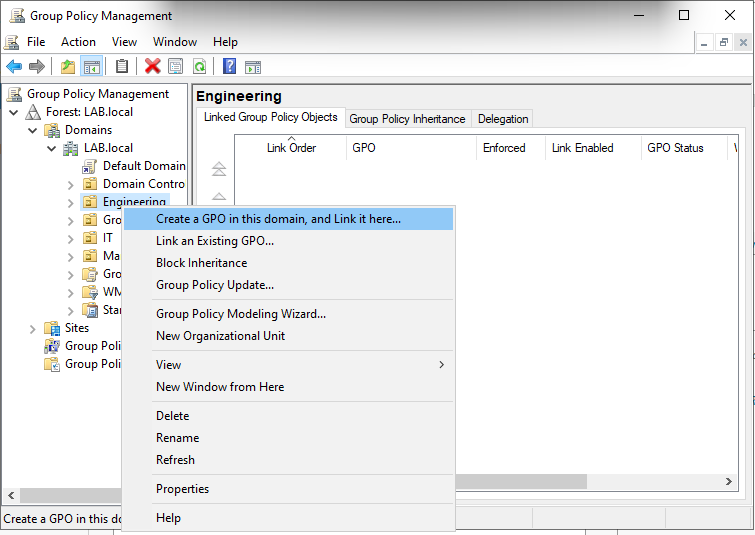
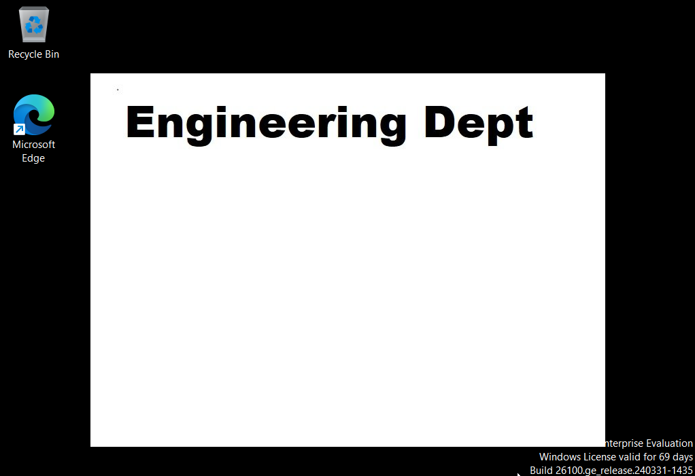
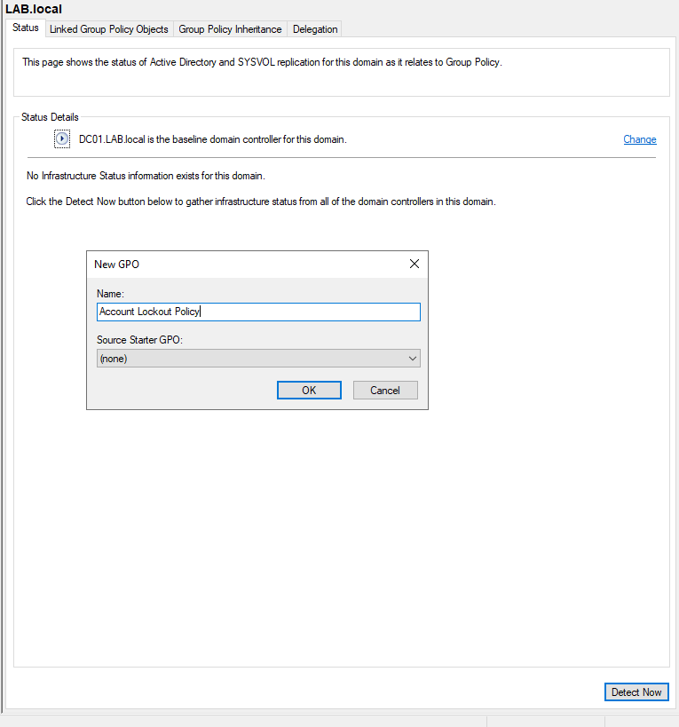
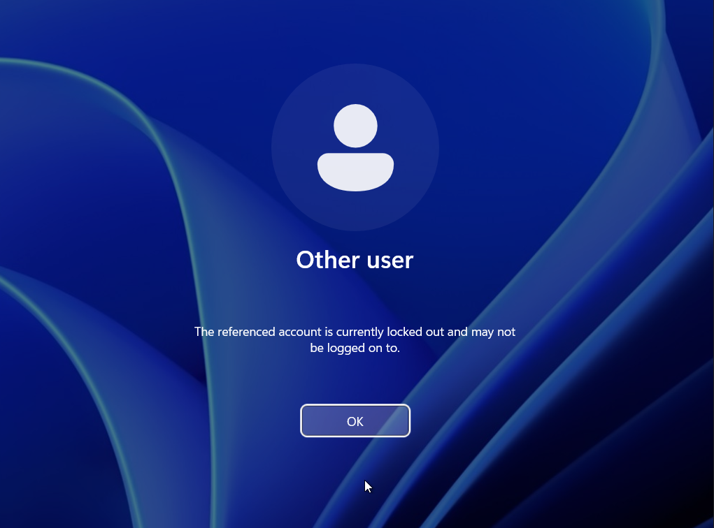
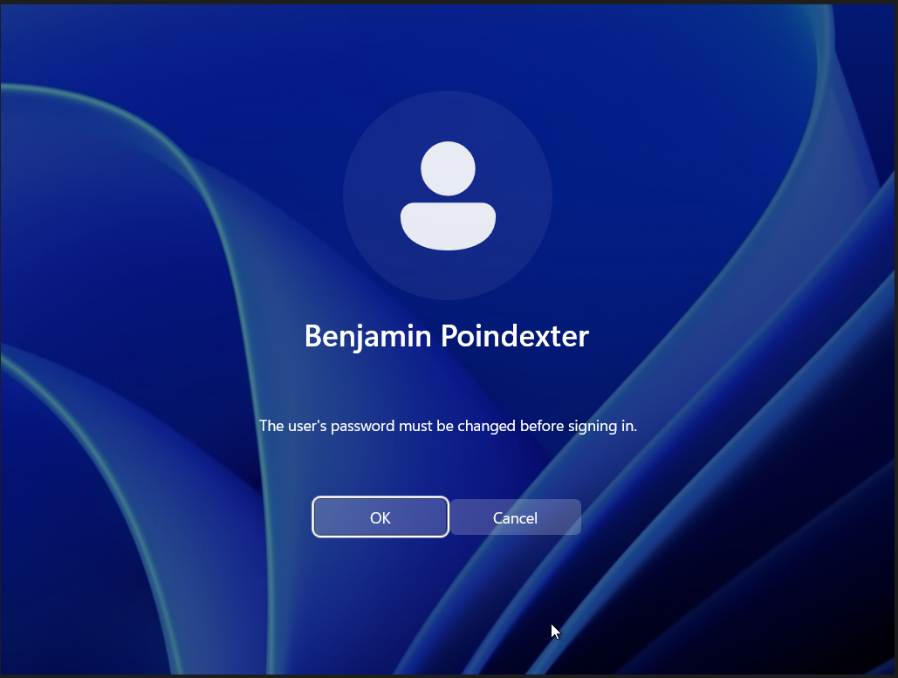

# Group Policy

Group Policy Objects (GPOs) are how Active Directory enforces configuration centrally. Rather than touching settings on individual workstations or user profiles, an administrator creates a GPO once, links it to a target (OU, domain, or site), and the directory propagates the configuration to every applicable client.

This section walks through two GPOs implemented in the lab — one targeting users by department, one targeting the entire domain — and verifies their effects from the Windows 11 client.

---

## How Group Policy applies

A few mechanics are worth establishing up front, because they explain why GPOs in this lab were structured the way they were.

**Two configuration trees per GPO.** Every GPO contains two independent halves:

- **Computer Configuration** — applied when a computer starts up, regardless of who logs in. Used for security baselines, system-wide settings, and policies that should follow the *machine*.
- **User Configuration** — applied when a user logs in, regardless of which computer they use. Used for desktop settings, drive mappings, and policies that should follow the *person*.

A GPO can use one half, the other, or both. The half a setting lives under determines when and how it's applied.

**Linkage targets the population.** GPOs are *created* under the `Group Policy Objects` container, then *linked* to one or more locations in the directory tree:

| Link target | Population affected |
|------|--------|
| Domain root (`LAB.local`) | Every computer and user in the domain |
| Specific OU (e.g. `Engineering`) | Computers and users in that OU (and child OUs by default) |
| Site | Computers/users in a specific AD site (rare in single-site labs) |

The lab uses both approaches — domain-root linkage for a universal security control, and OU-scoped linkage for a department-specific policy.

**Inheritance and refresh.** Child OUs inherit GPOs from parent containers unless inheritance is explicitly blocked. Clients refresh Group Policy on a default cycle (every 90 minutes plus a randomized offset, plus at boot/login); `gpupdate /force` from an elevated command prompt forces an immediate refresh during testing.

---

## GPO 1 — Department wallpaper (Engineering)

The first GPO demonstrates department-scoped User Configuration: a custom desktop wallpaper applied automatically to every user in the Engineering OU.

### Step 1 — Stage the wallpaper file

The wallpaper image needs to be reachable from every Engineering user's session at login. The `EngineeringShare` (created in [03 — Identity Structure](03-identity-structure.md)) is the natural location: it already exists, it's already SMB-accessible, and Engineering users already have read access to it.

A simple text-on-white image with "Engineering Dept" was placed in the share's root: `\\DC01\EngineeringShare\engineering-wallpaper.bmp`.

> **Production note:** Wallpapers deployed via GPO should generally be placed in a read-only location. SYSVOL is a defensible alternative since it replicates between domain controllers and is available wherever the user logs in. For a lab, EngineeringShare is fine — but in production, putting policy assets in a user-writable share invites accidental modification.

### Step 2 — Create and link the GPO

**Path:** Server Manager → Tools → Group Policy Management → expand `Forest: LAB.local` → `Domains` → `LAB.local` → right-click the **Engineering** OU → **Create a GPO in this domain, and Link it here…**



Naming the GPO descriptively matters: GPO names are how administrators (or auditors) understand the directory's policy posture months later. This one was named clearly enough that its purpose is obvious from the name alone.

Creating-and-linking in one step (rather than creating in `Group Policy Objects` and linking separately) is the more efficient path when the target OU is known up front.

### Step 3 — Configure the wallpaper setting

After creation, right-click the new GPO → **Edit** to open the Group Policy Management Editor.

**Path:** User Configuration → Policies → Administrative Templates → Desktop → Desktop → **Desktop Wallpaper**

| Field | Value |
|------|-------|
| Policy state | Enabled |
| Wallpaper Name | `\\DC01\EngineeringShare\engineering-wallpaper.bmp` |
| Wallpaper Style | Center (or Fill, Stretch — choice depends on image dimensions) |

The setting lives under **User Configuration** because wallpaper is a per-user setting that should follow the user across machines, not stay attached to a particular workstation.

### Step 4 — Verify on the client

After running `gpupdate /force` on the Windows 11 client (or simply logging out and back in as Matt Murdock), the wallpaper applies:



The same login flow as Foggy Nelson (in the IT OU) or Karen Page (in Management) shows the default Windows wallpaper, confirming the GPO's scoping is working as intended — only Engineering OU members receive the policy.

---

## GPO 2 — Account Lockout Policy (domain-wide)

The second GPO addresses a security control that applies to the whole domain: locking accounts after repeated failed login attempts. This mitigates online password guessing — an attacker who can try a handful of passwords against an account is constrained from running thousands.

### Why this GPO is linked at the domain root, not an OU

This is a real technical constraint, not a stylistic choice. **Account Lockout Policy and Password Policy applied via the default Group Policy mechanism only take effect when linked at the domain root.** Linking the same settings to an OU has no effect on domain user accounts. (The exception is *Fine-Grained Password Policies*, which use a separate object type — Password Settings Objects — and are configured outside the standard GPO workflow.)

For a lab demonstrating standard GPO behavior, the domain root is the correct target.

### Step 1 — Create the GPO

**Path:** Group Policy Management → right-click `LAB.local` (the domain itself) → **Create a GPO in this domain, and Link it here…** → name the GPO **Account Lockout Policy**.



### Step 2 — Configure the lockout threshold

**Path inside the GPO Editor:** Computer Configuration → Policies → Windows Settings → Security Settings → Account Policies → **Account Lockout Policy** → **Account lockout threshold**

Setting the threshold to a non-zero value (3 invalid attempts, in this lab) triggers a *Suggested Value Changes* dialog, which proposes companion settings:


| Setting | Value | Effect |
|--------|-------|--------|
| Account lockout threshold | 3 invalid attempts | Account locks after 3 consecutive bad passwords |
| Account lockout duration | 10 minutes | Account stays locked this long before auto-unlocking |
| Reset account lockout counter after | 10 minutes | The "bad attempt" counter resets after this much time without a failure |
| Allow Administrator account lockout | Enabled | The default Administrator account is also subject to lockout |

Accepting the suggested values produces a coherent lockout policy: three failures within ten minutes locks the account; the lock self-clears after another ten minutes, or sooner if an administrator intervenes manually.

The **Allow Administrator account lockout = Enabled** suggestion is worth highlighting. Historically, the built-in Administrator account was excluded from lockout, which made it the obvious target for online password attacks. Modern guidance (and Microsoft's default suggestion in Server 2022) is to subject Administrator to the same lockout policy as everyone else.

The GPO was set as **Enforced** at the domain link to prevent any child OU from blocking inheritance via *Block Inheritance*. Account lockout is the kind of control that should not be selectively turned off below the domain level.

### Step 3 — Verify lockout from the client

Logging in to the Windows 11 client as Benjamin Poindexter and entering the wrong password three times reproduces the expected lockout:



The lockout message is delivered by the Windows 11 client after the domain controller responds to the third bad attempt. The client doesn't learn about the lockout state independently; the DC enforces and communicates it.

### Step 4 — Recover via administrator password reset

With lockout confirmed, the recovery flow was tested next:

1. From `DC01`, opened **Active Directory Users and Computers** → located Benjamin Poindexter's account
2. Right-clicked the account → **Reset Password…** → set a temporary password and selected **User must change password at next logon**
3. The account's locked state was cleared as part of the reset

Returning to the Win 11 client and signing in with the temporary credential, the client correctly prompted for a password change before completing the login:



After setting a new permanent password, the login completed normally.

> The same recovery workflow is also available via PowerShell. The cmdlet equivalents (`Set-ADAccountPassword` and `Set-ADUser -ChangePasswordAtLogon`) are documented in [05 — PowerShell Automation](05-powershell-automation.md) so this section stays focused on the policy mechanics.

This recovery flow is also where [Issue 6 of the troubleshooting log](06-troubleshooting.md#issue-6--password-reset-blocked-by-account-flag) — the *Password never expires* flag preventing forced rotation — was diagnosed and resolved.

---

## Verification with `gpresult`

A useful command for confirming GPO application from a client (and one that shows up frequently in IT support workflows) is:

```cmd
gpresult /r
```

Run from an elevated command prompt on the Win 11 client, this produces a **Resultant Set of Policy** report that lists:

- Which GPOs applied to the current computer
- Which GPOs applied to the current user
- Any GPOs that were filtered out (and why)
- Group memberships affecting GPO application

For a help desk technician troubleshooting "why doesn't this user have the right wallpaper / drive mapping / printer?", `gpresult /r` is often the fastest path to the answer.


---

## What this section demonstrates

- **GPO scoping is a deliberate design choice, not an afterthought.** The wallpaper GPO is OU-scoped because it's a department-specific user setting; the lockout GPO is domain-scoped because it's a universal security control. Mixing those up — putting the lockout policy on a single OU, for example — would either be ineffective (account policies don't work that way) or expose users in unscoped OUs (other ineffective placements).
- **User Configuration vs Computer Configuration is a meaningful distinction.** The wallpaper "follows the user" because it's under User Configuration; the lockout policy "follows the account" via the DC's enforcement of the domain-wide setting. Knowing which side of a GPO to configure a setting under is half the battle in policy design.
- **Verifying from the client is the test that matters.** Configuring a GPO and trusting it works is not the same as logging in as an affected user and seeing the result. Both GPOs in this section were verified end-to-end from the Windows 11 client.
- **Recovery workflows belong in the same documentation as the controls that necessitate them.** A lockout policy without a documented unlock procedure isn't a complete control; it's a help desk ticket waiting to happen.

---

## Next steps

The recovery flow above used the GUI path through Active Directory Users and Computers. That same flow — along with onboarding, password reset, and other lifecycle tasks — can be automated via PowerShell, which is the focus of [05 — PowerShell Automation](05-powershell-automation.md).
