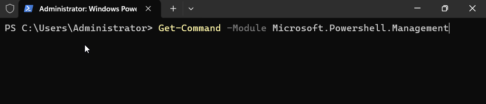
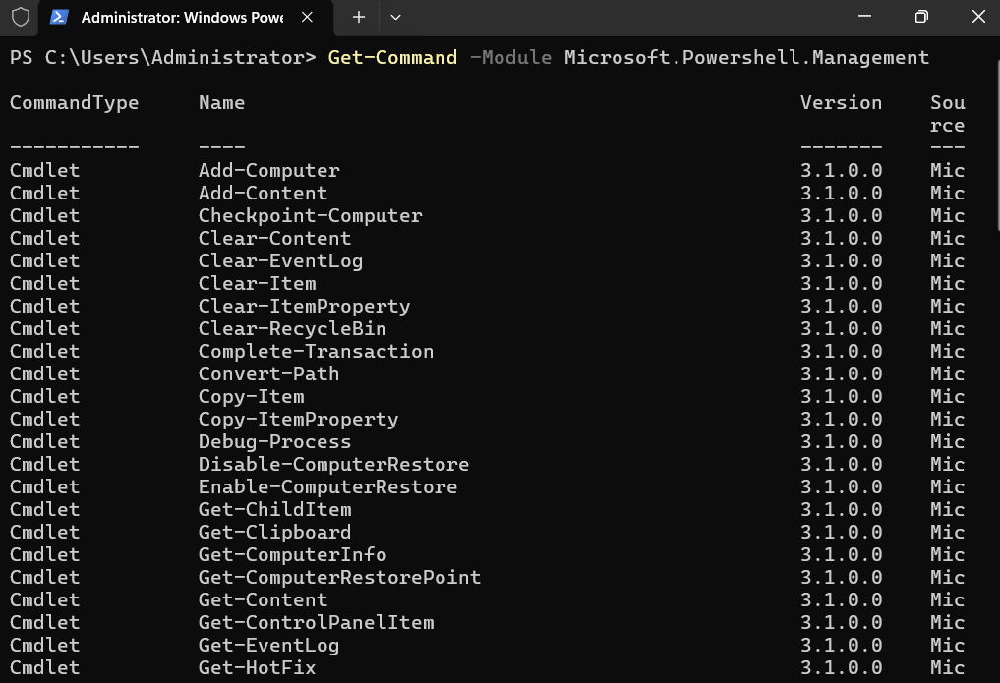
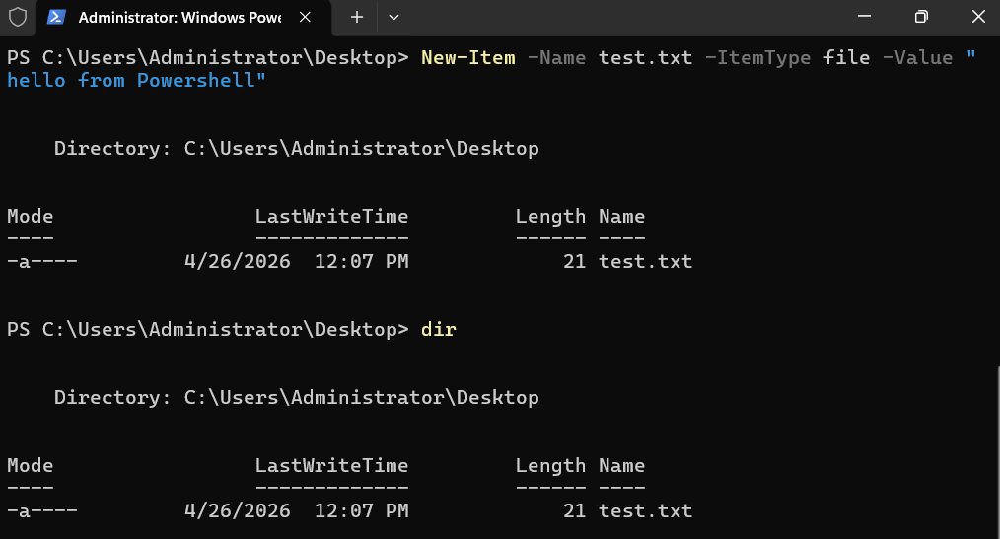
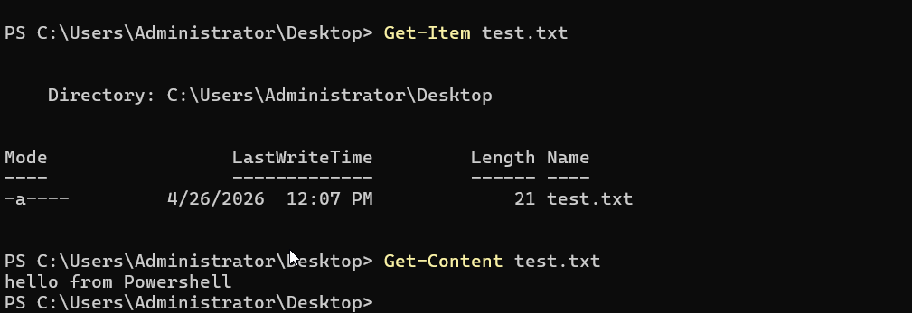
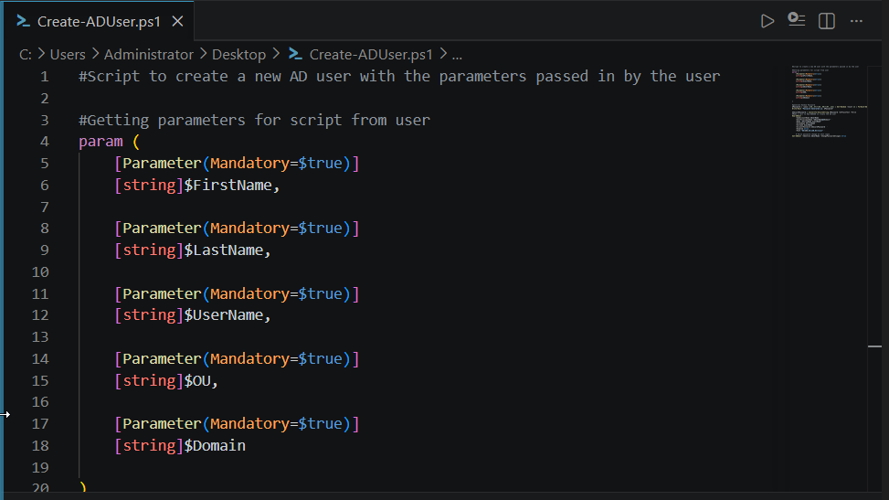
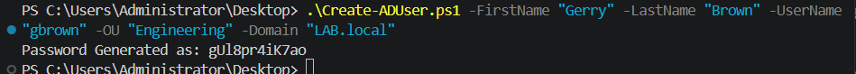

# PowerShell Automation

PowerShell is the preferred administration interface for Active Directory at any meaningful scale. The GUI tools (Active Directory Users and Computers, Group Policy Management Console) are fine for one-off changes; the moment a task needs to be repeatable, auditable, or applied to more than a handful of objects, PowerShell takes over. This section walks through the foundation — cmdlet structure, module discovery, and the `ActiveDirectory` module from RSAT — and then through a parameterized script that automates new-user onboarding.

The deliverable script, [`Create-ADUser.ps1`](../scripts/Create-ADUser.ps1), is also runnable from the repository as-is.

---

## PowerShell foundation: cmdlets and discovery

PowerShell commands (cmdlets) follow a strict **verb-noun** convention. The verb describes the action, the noun describes the target, and arguments follow as named parameters preceded by a hyphen.

```powershell
Get-Command -Module Microsoft.PowerShell.Management
```

Reading left to right: get (the action) all the commands (the target) from the specified module. Every cmdlet in the system follows this pattern, which means once a few dozen verbs are learned (`Get`, `Set`, `New`, `Remove`, `Add`, `Test`, `Start`, `Stop`, etc.), most cmdlet names become predictable.



Running it produces a list of every cmdlet available from the specified module:



`Get-Command` is one of three cmdlets that solve the "I know what I want to do but I don't know what it's called" problem in PowerShell:

| Cmdlet | Purpose |
|--------|---------|
| `Get-Command` | Find cmdlets by name pattern, verb, noun, or module |
| `Get-Help` | Read documentation, syntax, and examples for a known cmdlet |
| `Get-Member` | Inspect the properties and methods of an object that a cmdlet returned |

Together they make PowerShell self-documenting: a session is always one or two commands away from "what's available" and "how does it work."

---

## File operations as warmup

Before introducing AD-specific cmdlets, three Management module cmdlets establish the basic create / read / inspect pattern that will recur throughout the AD work:

```powershell
# Create a file with content in one step
New-Item -Name test.txt -ItemType file -Value "hello from Powershell"

# Inspect file metadata
Get-Item test.txt

# Read file contents
Get-Content test.txt
```





The `Get-Item` vs `Get-Content` distinction is worth internalizing: `Get-Item` returns the *object representing the file* (with properties like LastWriteTime, Length, Mode); `Get-Content` returns the *contents of the file*. The same dichotomy reappears with AD: `Get-ADUser` returns the user *object*, while a property like `mail` or `memberOf` is content read off that object.

---

## Adding Active Directory cmdlets via RSAT

A fresh PowerShell session on Windows Server 2022 doesn't include AD cmdlets by default — they live in the `ActiveDirectory` module, which ships as part of **Remote Server Administration Tools (RSAT)**.

**Path:** Start → Settings → Apps → Optional features → View features → search **RSAT** → install **RSAT: Active Directory Domain Services and Lightweight Directory Services Tools**.

After installation, verify the module is loadable:

```powershell
Get-Module -Name ActiveDirectory -ListAvailable
```

A successful install lists `ActiveDirectory` version `1.0.1.0` as a Manifest module. The companion command lists every cmdlet the module exposes:

```powershell
Get-Command -Module ActiveDirectory
```


The output exposes a couple of hundred cmdlets covering the full lifecycle of users, groups, computers, OUs, and policies. The naming convention from the foundation section applies directly: `New-ADUser`, `Get-ADComputer`, `Set-ADGroup`, `Remove-ADOrganizationalUnit`, and so on. Once the verb-noun pattern is internalized, exploring an unfamiliar module mostly means scanning for the noun you need.

---

## Reading from AD: `Get-ADUser`

The most-used cmdlet in day-to-day administration is `Get-ADUser`. By default it returns a sparse summary (name, SID, enabled state, distinguished name); the `-Properties *` flag returns the full object:

```powershell
Get-ADUser mmurdock -Properties *
```


A few of the output fields are worth highlighting because they map directly to the help-desk and security questions PowerShell is most often asked to answer:

| Attribute | Question it answers |
|-----------|---------------------|
| `CanonicalName` | Where does this user sit in the OU hierarchy? *(here: `LAB.local/Engineering/Matt Murdock`)* |
| `Enabled` | Is this account currently active? |
| `AccountLockoutTime` | Is the account locked right now, and if so, when? |
| `BadLogonCount` / `badPwdCount` | Have there been recent failed login attempts? |
| `LastLogonDate` | When did this user last successfully sign in? |
| `AccountExpirationDate` | Is there a scheduled expiration on this account? |
| `MemberOf` | Which security groups does this user belong to? |
| `CannotChangePassword` / `PasswordNeverExpires` | What account flags are set? |

For repetitive work, the output of `Get-ADUser` can be filtered or piped into other cmdlets:

```powershell
# Find every disabled user in the directory
Get-ADUser -Filter 'Enabled -eq $false'

# Find every account locked out right now
Get-ADUser -Filter 'LockedOut -eq $true'

# Reset a user's password and force change at next logon (one-liner)
Set-ADAccountPassword -Identity mmurdock -Reset `
    -NewPassword (Read-Host -AsSecureString -Prompt "New password")
Set-ADUser -Identity mmurdock -ChangePasswordAtLogon $true
```

The recovery cmdlets above are the PowerShell equivalent of the GUI-based password reset workflow demonstrated in [04 — Group Policy](04-group-policy.md). For a single user, the GUI is fine; for ten users, the script is the right answer.

---

## Writing to AD: `Create-ADUser.ps1`

The lab's automation centerpiece is a parameterized PowerShell script that wraps `New-ADUser` with a generated initial password and a forced password change. The full script is in [`scripts/Create-ADUser.ps1`](../scripts/Create-ADUser.ps1); the walkthrough below covers the design choices.

### Structure: three sections

The script breaks into three distinct sections that map to a clean mental model:

1. **Inputs** — accept and validate the caller's parameters
2. **Generate** — produce a random initial password
3. **Apply** — call the AD cmdlets to create the account and configure first-login behavior

### Section 1 — Parameter block

```powershell
param (
    [Parameter(Mandatory=$true)]
    [string]$FirstName,

    [Parameter(Mandatory=$true)]
    [string]$LastName,

    [Parameter(Mandatory=$true)]
    [string]$UserName,

    [Parameter(Mandatory=$true)]
    [string]$OU,

    [Parameter(Mandatory=$true)]
    [string]$Domain
)
```



Each parameter is marked `Mandatory=$true`, which causes PowerShell to prompt interactively for any value the caller didn't supply on the command line. This makes the script safe to run with no arguments (it asks) and equally safe to invoke from automation pipelines (caller supplies everything).

### Section 2 — Random password generation

```powershell
$Password = -join ((48..57)+(65..90)+(97..122) | Get-Random -Count 12 | ForEach-Object {[char]$_})
Write-Host "Password Generated as: $Password"

$SecurePassword = ConvertTo-SecureString $Password -AsPlainText -Force
```


The password generator combines three ASCII ranges — digits (`48..57`), uppercase (`65..90`), and lowercase (`97..122`) — then picks 12 characters at random and joins them into a single string.

The `ConvertTo-SecureString` call is required because `New-ADUser` won't accept a plain string for the `-AccountPassword` parameter. SecureString isn't strong cryptographic protection, but it's the type the cmdlet contract demands, and it keeps the password from sitting in the standard PowerShell variable history in plaintext form.

The `Write-Host` line surfaces the generated password to whoever ran the script, which is the help desk technician who then needs to communicate it to the new user out-of-band.

### Section 3 — Account creation

```powershell
New-ADUser `
    -SamAccountName $UserName `
    -UserPrincipalName "$UserName@$Domain" `
    -Name "$FirstName $LastName" `
    -GivenName $FirstName `
    -Surname $LastName `
    -AccountPassword $SecurePassword `
    -Enabled $true `
    -Path "OU=$OU,DC=LAB,DC=local"

Set-ADUser -Identity $UserName -ChangePasswordAtLogon $true
```

The backtick (`` ` ``) at the end of each `New-ADUser` line is PowerShell's line-continuation character — it lets a single command span multiple lines for readability.

The `-Path` argument constructs an LDAP-style distinguished name that places the new account under the specified OU within the domain. Once created, the account is immediately enabled and flagged for password change at next logon.

### Running the script

The script is invoked from the directory where it lives, with values supplied for each parameter:



Behind the scenes the script created the new `gbrown` account in the Engineering OU, set the generated password as the initial credential, and flagged the account so the user is prompted to set their own password on first login. The whole sequence — including all five parameter validations — runs in well under a second.

> **Side note:** The user account created in this run (`gbrown`, "Gerry Brown") is the lab's author. Using the script to onboard themselves into the lab they'd just built was the kind of small, satisfying loop that confirms an automation actually works end-to-end.

---

## Production-readiness notes

This is a learning-grade script. A few honest observations about what would change to make it production-grade — included not as criticism of the lab work, but to demonstrate awareness of the gap between "works in the lab" and "deploy to a real environment":

- **Hardcoded domain components.** The `-Path` argument hardcodes `DC=LAB,DC=local`, which means the script only works in this specific lab domain. A production version would parse the `-Domain` parameter into its DC components dynamically (`DC=$($Domain.Split('.')[0]),DC=$($Domain.Split('.')[1])` or a more robust equivalent).
- **Password complexity.** The 12-character generator includes digits and mixed-case letters but no special characters, and doesn't *guarantee* at least one of each character class. Most production password policies require all four classes; the generator could fail complexity validation in environments with stricter rules.
- **Error handling.** The script has no `try/catch` around the `New-ADUser` call. If account creation fails (duplicate sAMAccountName, invalid OU path, insufficient privileges), the script will surface the cmdlet error but not retry, log, or roll back any partial work.
- **Logging.** A production version would log every account creation attempt to a file or event log for audit purposes. Currently the only record is the screen output, which disappears when the session closes.
- **Group membership.** New users typically need to be added to one or more security groups as part of onboarding. A production version would accept a `-Groups` parameter and call `Add-ADGroupMember` after creation.

Each of these is a candidate enhancement when the lab moves into Phase 3 hardening work.

---

## What this section demonstrates

- **PowerShell is the scaling answer to AD administration.** The same operations available in Active Directory Users and Computers — create user, modify user, reset password, force rotation — are available as cmdlets, and the cmdlet versions are the only ones that scale beyond a handful of objects.
- **Module discovery is part of the workflow.** A working AD admin doesn't memorize every cmdlet name; they `Get-Command -Module ActiveDirectory` and scan for the verb-noun pair they need. Demonstrating the discovery flow is more useful than demonstrating any single cmdlet.
- **Parameterization makes scripts reusable.** Hardcoding a username and OU into a script makes it run once. Accepting parameters with `Mandatory=$true` validation makes the same script the foundation for every onboarding the help desk handles afterward.
- **Honest limitations strengthen technical writing.** The "production-readiness notes" section identifies gaps that a senior reviewer would flag anyway. Naming them first demonstrates that the gap between learning-grade and production-grade work is understood, which is a more useful signal than pretending the gap doesn't exist.

---

## Next steps

The infrastructure-building documentation is now complete: domain controller stood up ([02](02-domain-controller.md)), populated with users and shares ([03](03-identity-structure.md)), governed by Group Policy ([04](04-group-policy.md)), and scriptable via PowerShell automation (this section).

The remaining sections cover the supporting context: [01 — Lab Architecture](01-lab-architecture.md) details the VM and network topology decisions; [06 — Troubleshooting Log](06-troubleshooting.md) captures the issues encountered during the build; [07 — Active Directory Fundamentals](07-ad-fundamentals.md) provides the identity-protocol and authentication theory that frames the lab's relevance to security operations work.
